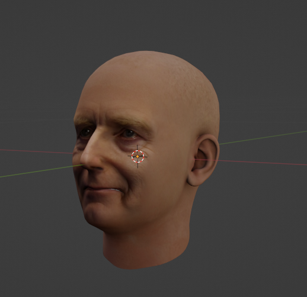

## Speech to emotion classifier

[](https://opensource.org/licenses/MIT)

Create live audience reactions animated from an audio speech that behind the scenes is predicting emotions every half a second.

It classifies speech audio into 8 classes of emotions - neutral, calm, happy, sad, angry, fearful, disgust, and surprised.



## Setup

```zsh
$ git clone https://github.com/HimanshuMittal01/speech_to_emotion_classifier.git
$ cd speech_to_emotion_classifier/
$ python3 -m venv venv
$ source vevn/bin/activate
$ pip install -r requirements.txt
```

## Training code

In order to train the models, you need to download RAVDESS dataset - speech audio only.<br>
Trained models will be available for download soon.

Go through the following notebooks in order.
1. split_process_data.ipynb
2. train.ipynb
3. inference.ipynb

## How to run

1. Set paths and configuration in `config.json`.
2. `sh run.sh`

## Evaluation

Evaluated 3 models trained on RAVDESS dataset (excluding song audio).<br>
It has 8 classes - ["neutral","calm","happy","sad","angry","fearful","disgust","surprised"]

Following accuracy is observed on 16 classes (8 classes bifuracted further by gender) in train/validation/test datasets.

1. XGBoost: ~95% / ~41% / ~25%
2. LSTM (3 layers - 64-64-64): ~76% / ~46% / ~26%
3. CNN (3 layers - 32-64-128): ~93% / ~50% / ~30%

Predicting gender through voice is decent given the size of the dataset. Accuracy observed is as follows:

1. XGBoost: ~85%
2. LSTM (3 layers - 64-64-64): ~90%
3. CNN (3 layers - 32-64-128): ~87%

## Work required for production
- Improving accuracy of the speech models
    - By using extra training datasey, maybe including song set and other datasets
    - Cross validation
- Real time smooth animation of different faces
    - Asynchronuos / Trigger calls to blender engine
    - Optimized predictions

## Contributing [](https://github.com/dwyl/esta/issues)
I made this project to improve public speaking (Some people will frown or make faces even when you are right, you just have to be confident ;)

More use cases, issues or pull requests are most welcome.
